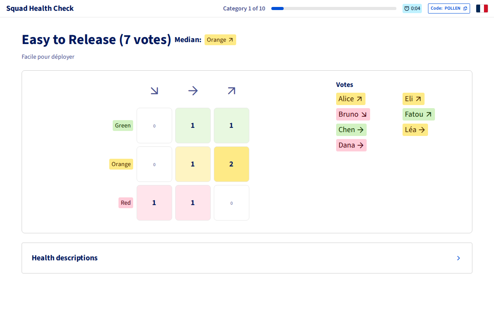
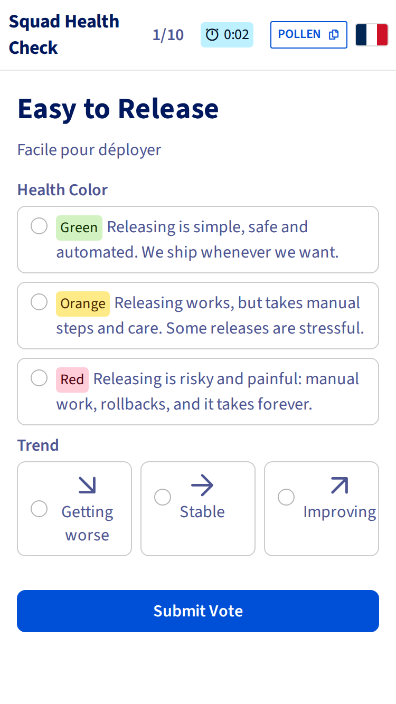
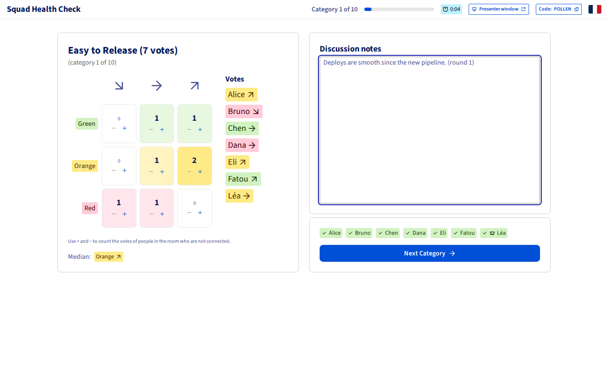
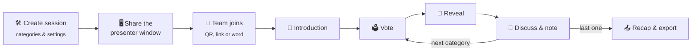
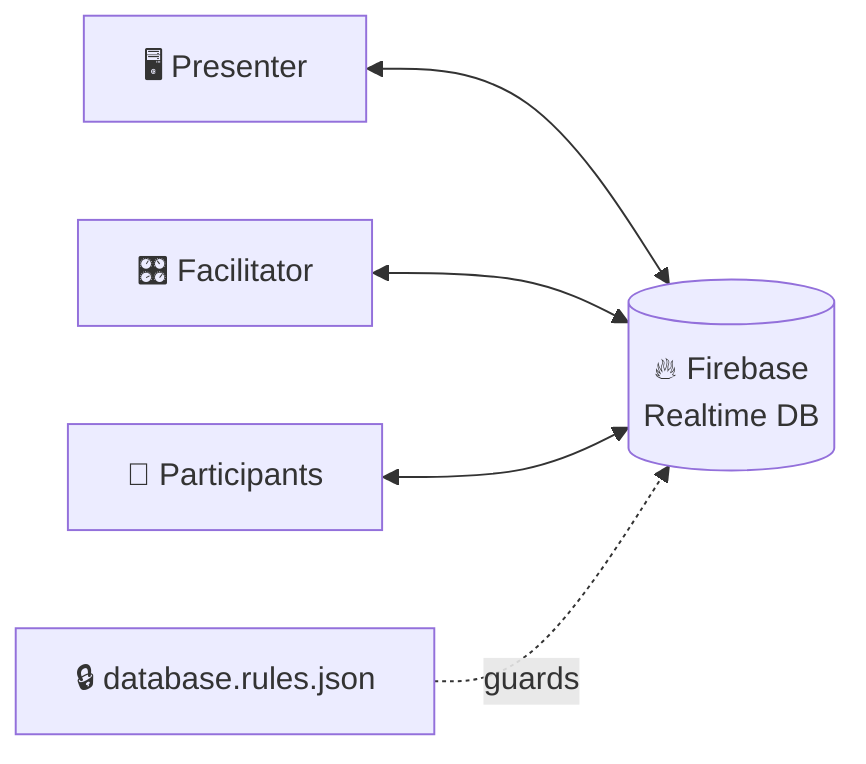

<div align="center">

# 🏥 Squad Health Check

**Run Spotify's Squad Health Check with your team, live: everyone votes on their phone and the results appear on the shared screen.**

[](https://github.com/feoche/squad-health-check/actions/workflows/deploy.yml)
[](#-accessibility)
[](#-accessibility)
[](https://react.dev)
[](https://www.typescriptlang.org)
[](https://firebase.google.com)
[](https://ovh.github.io/design-system/)

[**▶ Open the app**](https://feoche.github.io/squad-health-check/) · [Features](#-features) · [How to use](#-how-to-use) · [Setup](#-firebase-setup) · [Development](#-development) · [Accessibility](#-accessibility)

A static site on GitHub Pages, synced in real time through Firebase (free plan). 🇬🇧 English and 🇫🇷 French.

</div>

---

## 📸 Screenshots

<table>
  <tr>
    <th>🖥️ Presenter (shared screen)</th>
    <th>📱 Vote (phone)</th>
  </tr>
  <tr>
    <td></td>
    <td rowspan="3" valign="top"></td>
  </tr>
  <tr>
    <th>🎛️ Facilitator dashboard</th>
  </tr>
  <tr>
    <td></td>
  </tr>
</table>

---

## ✨ Features

### 🎬 Running the workshop

| | |
|---|---|
| 🪟 **Three views** | A **presenter** window to screen-share (progress, category, colours, vote count, results), a phone-first **voting** view for participants, and a **facilitator** dashboard only the session creator can open |
| 🔤 **Word codes** | Each session gets a six-letter word (*PIRATE*, *GARDEN*…) that is easy to read out and type; a word belongs to one session only, until that session is deleted a semester (183 days) after creation 🔒 |
| 📖 **Introduction step** | A built-in presentation of the workshop between the lobby and the first category |
| 🎮 **Facilitator controls** | The facilitator drives the flow (start, reveal, next, end) from their own window and chooses at creation whether they take part in the vote |
| ⏱️ **Round timer** | Every view shows the time spent on the current category; it quietly turns 🟠 amber past the time slot chosen at creation (1–30 min, 10 by default, about 2 hours for 10 categories with the intro and wrap-up), then 🔴 red at 150% of it |
| 👥 **Participant cap** | At most 15 people (facilitator included) can join a session 🔒 |

### 🗳️ Votes and results

| | |
|---|---|
| 📊 **Live results for the facilitator** | The facilitator's view fills the vote matrix as votes arrive, once they have voted (or from the start when they don't vote); the shared screen still waits for the reveal |
| 🎉 **Auto-reveal** | Votes are revealed when every voter has voted (from the facilitator's open window); voters whose app is disconnected are marked in the facilitator view, which suggests revealing by hand once the others have voted |
| 🕶️ **Vote anonymization** | Chosen at creation: *off* (everyone sees who voted what once a round is revealed), *facilitator only* (only the facilitator sees names; the shared screen shows totals) or *full* (totals only). Names are never visible while a round is being voted 🔒 |
| ➕ **Votes for people without the app** | During a round, the facilitator adds or removes votes in the matrix for people in the room who are not connected; they are marked and can be reset |
| 📝 **Private facilitator notes** | A note per category in the facilitator view, never on the shared screen; only the facilitator can read them 🔒 |

### 🧩 Preparing and following up

| | |
|---|---|
| 🗂️ **Categories** | Edit, add, remove and reorder the categories (drag and drop or the ↑/↓ buttons); removed ones stay among the suggestions, and the last choice is the default for the next session |
| 📤 **Recap export** | The facilitator edits the notes of every category at the end and downloads results and notes as **Markdown**, an accessible **PDF**, or **JSON** (format: [`public/session-export.schema.json`](public/session-export.schema.json)) |
| 📈 **Comparison with the previous session** | The JSON of a past session, picked at creation (the last one finished in this browser by default) or imported on the recap, shows each category's previous median and how it moved |
| 🌍 **English and French** | Follows the browser language; the flag in the navbar switches it, in every open window |
| ♿ **Accessible** | WCAG 2.2 AA for the app, PDF/UA-1 for the PDF report (see [Accessibility](#-accessibility)) |

<sub>🔒 = enforced by the database rules, not only by the app.</sub>

---

## 🚀 How to Use



1. **Facilitator** clicks "Create Session" → customises categories and settings (whether they vote, time per category, vote anonymization, previous session to compare with) → starts session → enters their name → lands on the facilitator view
2. Facilitator clicks **Presenter window** and shares that window (not the facilitator one)
3. **Team members** scan the QR code or open the shared link (or enter the six-letter session word) → enter their name
4. Facilitator clicks **Start workshop** → the introduction is on the shared screen, read out from the facilitator view → **Start first category**
5. For each category:
   - Everyone votes a **color** (🟢 happy / 🟠 issues / 🔴 needs fixing) and a **trend** (↗ / → / ↘) on their phone
   - The shared screen shows how many votes are in; votes are revealed when everyone has voted (or the facilitator forces reveal)
   - Team discusses; the facilitator writes the category's note in the facilitator view, and adds the votes of people without the app with + / −
   - Facilitator clicks "Next Category"
6. At the end, the shared screen shows the vote recap; the facilitator reviews every note and **downloads the report** (with notes) — keep the JSON to compare with next time

> [!TIP]
> - The facilitator's tab must stay open for auto-reveal and for moving on; reloading it is fine (identity is kept).
> - Two tabs in the same browser count as the same participant — use another browser or a private window to test alone.

> [!WARNING]
> - The facilitator role is tied to the browser that created the session — don't create it from a private window you'll close.
> - Known limitation: a participant tampering via devtools could submit more than one vote per round; the vote total shown in results makes this visible.

---

## 🔥 Firebase setup

<sub>Once, about 10 minutes.</sub>

1. [Firebase console](https://console.firebase.google.com) → **Add project** (Analytics not needed).
2. **Build → Authentication → Get started → Sign-in method → Anonymous → Enable.**
3. **Authentication → Settings → Authorized domains** → add `<your-user>.github.io`.
4. **Build → Realtime Database → Create database** → choose a location → **locked mode**.
5. **Realtime Database → Rules** → paste [`database.rules.json`](database.rules.json) → **Publish**. Repeat whenever that file changes.
6. **Project settings → Your apps → Web (`</>`)** → register → copy the config into [`src/lib/firebaseConfig.ts`](src/lib/firebaseConfig.ts).

> [!IMPORTANT]
> Publish rule changes **before** pushing the app to `main` — the app may depend on them. CI only deploys the app, never the rules.

> [!NOTE]
> The web config is public by design; access is controlled by the rules. Optionally restrict the API key to your Pages domain in Google Cloud console → APIs & Services → Credentials.

---

## 💻 Development

```bash
npm install
npm run dev       # http://localhost:3000
npm test          # unit tests
npm run workshop  # simulated workshop against the dev server (see below)
```

### 🤖 Workshop simulation

`npm run workshop` plays a whole session in headless Chromium (`npx playwright install chromium` once): a facilitator, the presenter window and six participants with different behaviours:

| 📱 Phone | 🇫🇷 French browser | ⌨️ Keyboard only | 🐢 Late joiner | 🔄 Vote edit and reload | 🚪 One who leaves |
|:-:|:-:|:-:|:-:|:-:|:-:|

It checks every screen, runs axe on each view and phase, downloads the three reports and exits with an error on any issue. Screenshots, reports and `summary.json` land in `workshop-report/`; `BASE` and `OUT` override the app URL and that folder.

> [!CAUTION]
> It creates a real session in the Firebase project of `src/lib/firebaseConfig.ts`.

---

## 🌐 Deployment (GitHub Pages)

1. Repo **Settings → Pages → Source: GitHub Actions**.
2. Push to `main`. The workflow in [`.github/workflows/deploy.yml`](.github/workflows/deploy.yml) tests, builds and deploys.
3. Share `https://<your-user>.github.io/squad-health-check/` 🎉

---

## ✅ Manual test checklist

<details>
<summary>17 steps with two browsers — click to expand</summary>

<br>

Use two browsers (or one normal + one private window): **A** = facilitator, **B** = participant.

1. A: create a session (settings left as is), enter a name → facilitator view with the share link, participants (A with 👑) and "You take part in the vote · Vote anonymization: Off".
2. A: click **Presenter window** → a window "Presenter — <CODE>" shows the code, QR and participants, with no buttons.
3. B: open the share link, enter a name → B appears in A's view and in the presenter window.
4. A: Start workshop → presenter shows the introduction, B sees the colour and trend legend. A: Start first category.
5. B (phone size): the vote form fits without scrolling and shows no vote counter. B votes → presenter shows "1 / 2 votes received"; A's view shows B as voted.
6. During voting, Firebase console → Realtime Database → Rules → **Rules Playground**: type *read*, location `/sessions/<CODE>/votes/<current index>`, Authenticated → **Run** → *Denied*. Also try *write* `true` at `/sessions/<CODE>/closed/<current index>` as A's UID → *Denied*.
7. A: vote → round auto-reveals on every screen with 2 votes.
8. A: write a note → nothing appears on B's screen or in the presenter window. Rules Playground: *read* `/sessions/<CODE>/facilitator`, Authenticated with B's UID → *Denied*.
9. B: reload → B lands back in the session without re-entering a name; same for A (still facilitator). B: close the tab during a round → A's view marks B as disconnected and suggests revealing by hand; B reopens the link → the mark goes away.
10. A: Next Category … Finish Session → presenter and B show the vote recap without notes; A edits a past note and downloads Markdown, PDF and JSON (with notes).
11. New session created with "I take part in the vote" off: "X / N" excludes A, A has no vote form, auto-reveal fires once B has voted. Rules Playground: *write* `true` at `/sessions/<CODE>/voters/<index>/<A's UID>` as A → *Denied*; *write* `true` at `/sessions/<CODE>/state/facilitatorVotes` as A → *Denied*.
12. Anonymization, one session per level, Rules Playground *read* `/sessions/<CODE>/ballots/<current index>`:
    - during voting → *Denied* for A and B at every level;
    - after reveal, **Off** → *Allowed* for A and B; presenter and A's view list names;
    - after reveal, **Facilitator only** → *Allowed* for A, *Denied* for B; only A's view lists names, not the presenter;
    - after reveal, **Full** → *Denied* for A and B; no names anywhere;
    - *write* a different value (e.g. `"off"` on a Full session, `"full"` otherwise) or `null` at `/sessions/<CODE>/state/anonymity` as A → *Denied*.
13. New session created with 1 minute per category: once voting opens, A, B and the presenter show the same elapsed time; past 1:00 it turns amber with a warning icon and keeps counting, past 1:30 red; Next Category restarts it at 0:00. Rules Playground: *write* `5` at `/sessions/<CODE>/state/categoryMinutes` as A → *Denied*.
14. Open `…/#/session/ZZZZZZ` → "Session not found".
15. B: open `…/#/session/<CODE>/present` → "Only the facilitator can open the presenter view"; `…/#/session/<CODE>/notes` → redirected to the session.
16. New session created with the JSON of test 10 as previous session: after each reveal, A's view shows the previous median and Better / Same / Worse.
17. Accessibility, keyboard only: Tab from a fresh load → "Skip to main content" first; reorder a category with ↑/↓ and focus stays on the moved category; join, vote and run a round without the mouse; with a screen reader (NVDA + Firefox or VoiceOver + Safari), B hears each new round, the reveal and the end of the session, and A hears votes arriving. Open the PDF in Acrobat or NVDA: it reads the title, then each category's heading, median and note, without the footers.

</details>

---

## ♿ Accessibility

Target: **WCAG 2.2 level AA** for the app, **PDF/UA-1** for the PDF report. Design and decisions: [`docs/specs/2026-10-06-accessibility-design.md`](docs/specs/2026-10-06-accessibility-design.md).

When changing the UI, keep:

- 🔢 **Headings in order** — the navbar brand is the only `h1`; a page or view titles itself with an `h2`, sections use `h3`. Pick the look with the ODS `Text` preset and the level with `as`.
- 🧱 **ODS first** — ODS components label fields, link errors and hide icons; an icon-only button still needs an `aria-label`.
- 🎯 **Focus** — when a control disappears with its view, move the focus to what replaces it (`useFocusIfLost`, or an explicit target); a failed submit focuses the first invalid field.
- 📣 **Status messages** — anything shown without moving the focus (copied, votes received, a new round…) goes through a `role="status"` region that stays mounted; errors use `role="alert"`.
- 🎨 **Colour** — ODS tokens only, 4.5:1 for text, never colour alone to carry meaning.
- 🌍 **Strings** in both languages in [`src/lib/i18n.ts`](src/lib/i18n.ts), including the hidden ones (labels, announcements).
- 📄 **PDF** — every text in a tagged structure element, every decoration in `artifact()`; `pdfReport.test.ts` checks the tags.

Checking:

- **App** — run the [axe DevTools](https://www.deque.com/axe/devtools/) extension (WCAG 2.2 AA rules) on each page and session phase, at desktop and 320px widths; then the keyboard and screen reader steps of the [manual test checklist](#-manual-test-checklist).
- **PDF** — download a report and validate it with [veraPDF](https://verapdf.org):

  ```bash
  docker run --rm -v "$PWD":/data verapdf/cli --flavour ua1 --format text /data/squad-health-check-<CODE>.pdf
  ```

---

## 🧰 Tech Stack

| Layer | Tech |
|-------|------|
| ⚛️ Frontend | React 18 + TypeScript + Vite |
| 🎨 UI | [OVHcloud Design System](https://ovh.github.io/design-system/) (`@ovhcloud/ods-react`, `@ovhcloud/ods-themes`) + layout CSS on ODS tokens |
| ⚡ Realtime | Firebase Realtime Database + Anonymous Auth |
| 🌐 Hosting | GitHub Pages (GitHub Actions) |
| 📄 PDF export | PDFKit (tagged PDF/UA) with Source Sans 3 from `source-sans`, loaded on demand |
| 🧪 Tests | Vitest; pdf.js reads the PDF back |



## 🗺️ Project Structure

<details>
<summary>Folder tour — click to expand</summary>

```
├── database.rules.json     # Firebase security rules (published by hand, see Firebase setup)
├── docs/
│   ├── screenshots/        # README images
│   ├── specs/              # Design of each feature
│   └── plans/              # Implementation plans
├── public/
│   └── session-export.schema.json  # JSON export format
├── scripts/
│   └── workshop.mjs        # Simulated workshop (npm run workshop)
├── src/
│   ├── components/         # React components
│   │   └── facilitator/        # Facilitator dashboard
│   ├── data/               # Default categories
│   ├── lib/
│   │   ├── firebase.ts         # Firebase init + anonymous sign-in
│   │   ├── firebaseConfig.ts   # Public web config
│   │   ├── sessionStore.ts     # All realtime reads/writes
│   │   ├── deriveClientState.ts# Raw data → UI state (pure, tested)
│   │   ├── sessionCode.ts      # Codes and random keys
│   │   ├── serialize.ts        # Firebase-safe category payloads
│   │   ├── i18n.ts             # English and French messages, language switch
│   │   ├── exportReport.ts     # Markdown and JSON exports
│   │   ├── pdfReport.ts        # Accessible PDF export
│   │   ├── sessionHistory.ts   # Previous session: JSON format, storage, comparison
│   │   ├── roundTimer.ts       # Time slots and timer thresholds
│   │   ├── voteScore.ts        # Vote weights and median
│   │   ├── usePageTitle.ts     # Tab title per page
│   │   └── useFocusIfLost.ts   # Focus recovery when a view replaces the focused control
│   ├── pages/              # Home, CreateSession, SessionPage, PresenterPage
│   ├── styles/             # Layout CSS on ODS tokens
│   └── types.ts            # Shared types
└── .github/workflows/      # Pages deployment
```

</details>

---

<div align="center">
<sub>Built on the <a href="https://engineering.atspotify.com/2014/09/squad-health-check-model/">Spotify Squad Health Check model</a> · Made with 💙 and the <a href="https://ovh.github.io/design-system/">OVHcloud Design System</a></sub>
</div>
